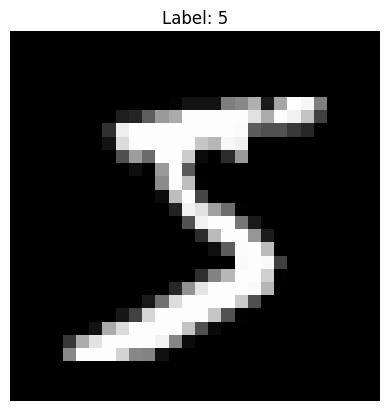
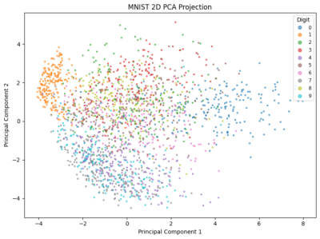
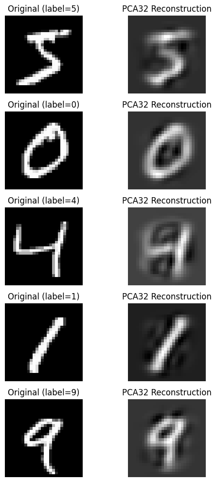
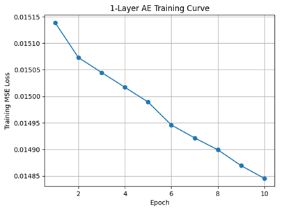
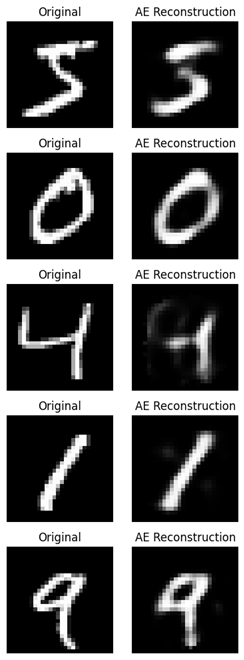
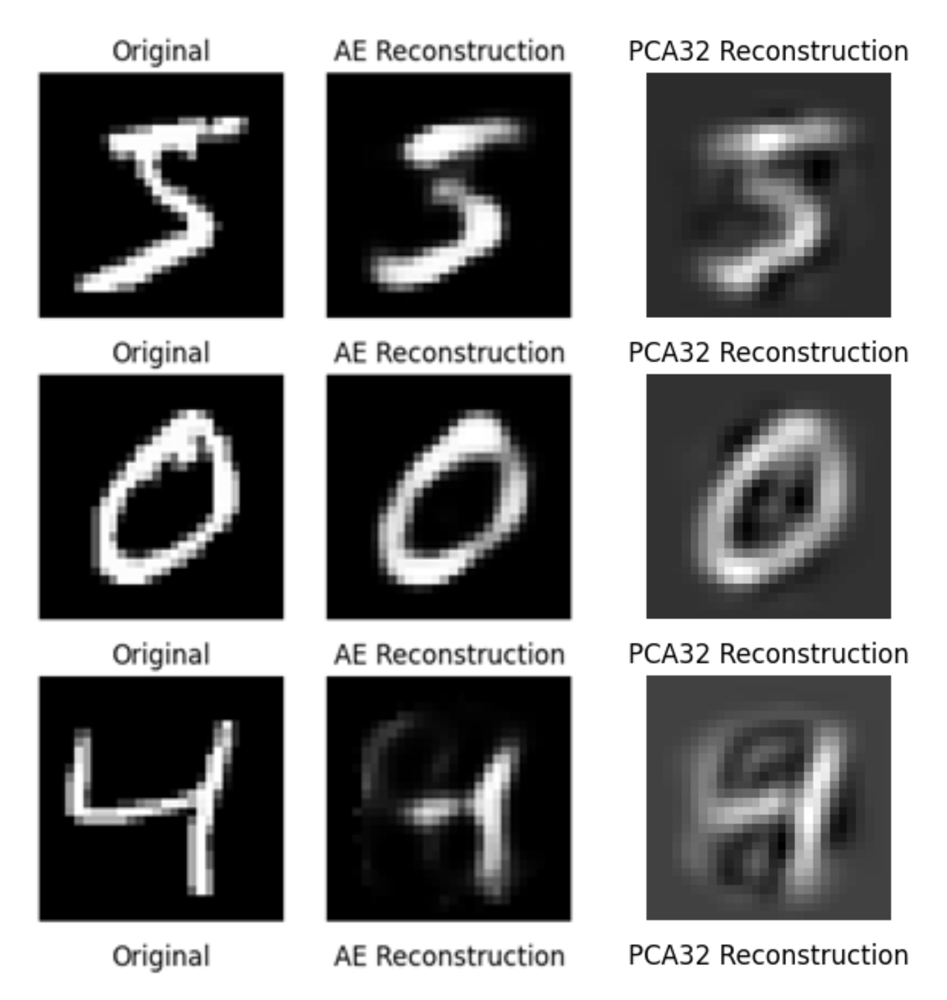

## Project 4 - Dimension Reduction with PCA and AE Report

## Group Members
- Mauricio Garcia-Paez
    - Wrote code implementing all 3 tasks
    - Recorded video (10 minutes)
- Madelyn Good
    - README and Markdown report
    - Recorded video (5 minutes)

## Project Overview
[Principal Component Analysis (PCA)](https://scikit-learn.org/stable/modules/generated/sklearn.decomposition.PCA.html) is a dimensionality reduction and machine learning method used to simplify a large data set by finding the most important patterns, known as Principal Components.

[Autoencoder (AE)](https://www.kaggle.com/code/residentmario/autoencoders) is a neural network and deep learning method used to compress (encode) and decompress (decode) data (input).

The [MNIST Dataset](https://www.kaggle.com/code/heeraldedhia/mnist-classifier-first-deep-learning-project) contains 70,000 images of handwritten digits: `0` through `9`. Each image is 28x28 pixels.

The goal of this project is to train a model to compress these images from the MNIST Dataset using dimensionality techniques like PCA and AE. 

This project is implemented using sklearn, a machine learning library in Python. Each method is extended using PyTorch and MatPlotLib.

## Task 0 - Base Model


This is an example of the data we will be analyzing. This model is a reconstructed 28x28 image pulled from the MNIST Dataset.

## Task 1 - PCA
### A. Reduce to 2D (for visualization) 
In this task, we apply PCA to simplify the high dimensional MNIST Dataset into just 2 features. The first 2,000 images are plotted.



### B. Reduce to 32D (for reconstruction)
Plot

### C. Reconstruct and Compute MSE Loss
After reducing the data we then reconstruct it back to its original size. 

In this task, we compute Mean Squared Error (MSE) to measure how close the reconstructed data is to the original data. 

```text
MSE Loss (32D): 0.017180
```
Low MSE means most of the important information was kept. High MSE means important information was lost.

### D. Compare Image Samples (PCA)


Here is a side by side comparison of the original images before compression (left), and the reconstructed images after compression (right). If you can still make out the number in the reconstructed images, that means compression worked well! 


## Task 2 - 1 Layer AE
### A. Build an Autoencoder
In this task, we implement an Autoencoder (AE) using activation functions such as sigmoid and ReLu.

Sigmoid is a logistic function used in the output layer. ReLu is a non-linear function used in the hidden layer.

Our encoder has a hidden layer with `32` neurons and will be activated using ReLu. The decoder uses Sigmoid. 

To configure the number of input and output features, change `nn.Linear(784, 32)` to match your input data shape. Here we are using a vector with `784` compressed values (input) and reconstructing them into a vector with `32` values (output). 

### B. Train using MSE Loss
In this task, we train our Autoencoder we built in Task 2A to compile with MSE Loss.

An epoch is when our model completes one full analysis of the training dataset. We will train 10 epochs on the MNIST dataset and output the MSE Loss after training.



```text
Epoch  1 Loss: 0.015139
Epoch  2 Loss: 0.015073
Epoch  3 Loss: 0.015045
Epoch  4 Loss: 0.015017
Epoch  5 Loss: 0.014989
Epoch  6 Loss: 0.014946
Epoch  7 Loss: 0.014922
Epoch  8 Loss: 0.014899
Epoch  9 Loss: 0.014869
Epoch 10 Loss: 0.014845
```

This training curve shows loss is steadily decreasing over 10 epochs, meaning that our model is consistently learning. 

Initial loss: `0.015139` 
Final loss: `0.014845`

A small but steady improvement.

### C. Compare Image Samples (AE)


### D. Compare AE vs PCA


In this task, we analyze the difference in PCA and AE techniques. We compute the reconstruction of the PCA dataset and compare it to AE dataset. We also visually evaluate the images.

PCA: `0.0171800`
AE: `0.0014800`

Based on our findings, AE performed better both numerically and visually. 


## Task 3 - Deep AE
### A. Modify 1 Layer AE

### B. Implement Activation Functions

### C. Compare Results


## Code Explanation Video
### Part 1
By Mauricio Explaining Tasks 1 and 2
https://www.loom.com/share/f429dfe9bc7d4dff8295c1cfd28abf20?sid=923d464e-47ba-4432-a5fb-d6dcd721a2c2


## How To Run Code
Run the code in Jupyter notebook.

